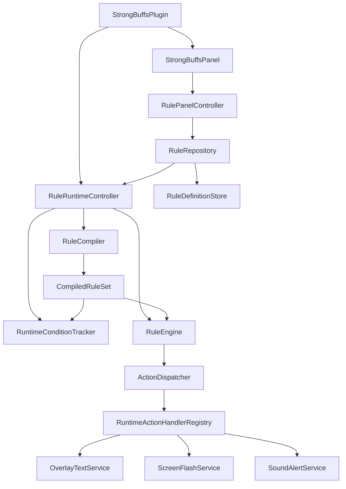
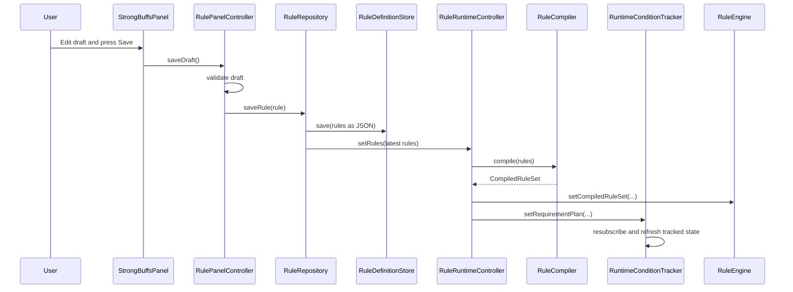
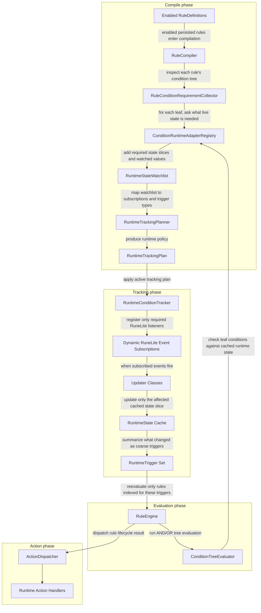
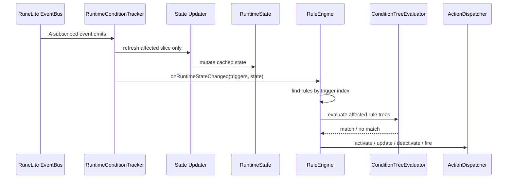

# Strong Buffs

A [RuneLite](https://runelite.net) Plugin Hub plugin that brings WeakAuras-style conditional overlays to Old School RuneScape.

Define **Rules** - visual and audio indicators that activate when configurable in-game conditions are met.

**Examples:**
- Flash the screen red when HP drops below 30%
- Show a warning when prayer points fall under 10
- Play a sound when special attack energy hits 100%
- Alert when entering the wilderness with a certain item equipped

## Legality

This plugin is built for and submitted to the [RuneLite Plugin Hub](https://runelite.net/plugin-hub). It follows a pretty strict approach to feature development:

- All features comply with the [Jagex Third-Party Client Guidelines](https://secure.runescape.com/m=news/third-party-client-guidelines?oldschool=1)
- All features comply with RuneLite's Plugin Hub submission policy
- The approved feature list is documented in [`docs/runelite-wiki/rejected-features.md`](docs/runelite-wiki/rejected-features.md)
- For devs: always think about how a feature may be abused. If it has potential for abuse, it is not implemented. For example, chat reading as a condition could be used to know what phase a boss is in.
- The plugin is intended to be a QoL overlay for players to track their own stats and status effects. It is not intended to provide information that would give players an unfair advantage in PvE or PvP content. For combat related conditions, it should not do anything that no other plugin does. For example: prayer tracking is fine.
- If a feature is even borderline grey, it is not implemented.

## Development

The project is built around persisted rule definitions plus a runtime pipeline that evaluates those rules against cached game state.

### Core Concepts

**Definitions**

Definitions are the approved building blocks of the system.

- A `ConditionDefinition` describes one leaf condition the user can configure, such as HP below a threshold, prayer active, item equipped, or being inside an instance.
- An `ActionDefinition` describes what should happen when a rule activates, such as showing overlay text, flashing the screen, or playing a sound.
- `DefinitionCatalog` is the source of truth for which definition types exist. It is used by the editor and by JSON deserialization, so the same whitelist drives both UI and persistence.

Definitions are persisted data only. They contain editor metadata, validation, copy logic, and type IDs. They do not talk to the RuneLite API directly.

**Rules**

A `RuleDefinition` is the user-owned configuration object that ties everything together.

- `rootGroup`: a tree of `ConditionGroup` and `ConditionDefinition` nodes
- `action`: the `ActionDefinition` to run
- `activationMode`: `WHILE_ACTIVE`, `ON_ENTER`, or `ON_EXIT`
- `cooldownTicks`: optional suppression for repeated activations
- `enabled`: whether the rule participates in runtime compilation

In practice: a rule is "when these conditions match, do this action."

**Actions**

Actions are split into two layers on purpose:

- Persisted action definitions live under `model/action`
- Runtime execution lives under `runtime/action`

### Main Layers

- `model/`: persisted condition, action, and rule definitions
- `panel/`: Swing editor UI, draft editing, validation, and unsaved-change flows
- `RuleDefinitionStore`: JSON serialization into RuneLite config
- `panel/state/RuleRepository`: bridge from persisted rules to the live runtime
- `runtime/condition/`: condition evaluation, runtime requirement collection, and tracking plans
- `runtime/tracker/`: event-driven caching of RuneLite state
- `runtime/engine/`: rule compilation, trigger indexing, activation semantics, and cooldown handling
- `runtime/action/`: execution of actions

### Core Logic

The runtime does not evaluate persisted rules by querying RuneLite ad hoc. Instead, it compiles enabled rules into a tracking plan, keeps a cached runtime snapshot up to date, and reevaluates only the rules affected by the latest triggers.

#### 1. Persistence of Rule Definitions

`RuleDefinitionStore` serializes the rule list to one RuneLite config entry as JSON..

`RuleRepository` is the only bridge between persisted edits and the live runtime. When the panel saves or deletes a rule, the repository updates storage and republishes the latest rule set to the runtime controller.

#### 2. Enabled Rules Are Compiled

`RuleRuntimeController` sends the latest persisted rules to `RuleCompiler`.

Compilation does three things:

- filters to valid enabled rules
- collects the runtime requirements of each rule's condition tree
- builds a `RuleTriggerIndex` so the engine can reevaluate only rules affected by a given runtime trigger

The requirement collection step walks the condition tree and asks `ConditionRuntimeAdapterRegistry` what each condition needs. That produces a `RuntimeStateWatchlist`.

#### 3. Tracking Is Selective

`RuntimeTrackingPlanner` turns the watchlist into a `RuntimeTrackingPlan`.

That plan contains:

- which RuneLite subscriptions are needed, this is done so we don't keep expensive listeners active when no rules need them. For example, if no enabled rule cares about skill levels, we don't subscribe to `StatChanged` events at all.
- which coarse runtime triggers those subscriptions can emit

#### 4. Runtime State Is Cached

`RuntimeConditionTracker` owns all RuneLite API reads and keeps a cached `RuntimeState` up to date.

`RuntimeState` is a single source of truth for all tracked game state relevant to rules.

Updater classes refresh only the affected slice of state when a RuneLite event comes in. For example, when a `StatChanged` event comes in, only the relevant skill level is updated in the cache.

When tracked data changes, the tracker notifies listeners with a set of `RuntimeTrigger` values plus the latest cached `RuntimeState`.

#### 5. The Engine Applies Rule Semantics

`RuleEngine` listens to runtime changes and evaluates rules through `ConditionTreeEvaluator`.

The evaluator handles boolean tree traversal:

- `AND` groups require every child to match
- `OR` groups require at least one child to match

Leaf condition meaning is delegated back to `ConditionRuntimeAdapterRegistry`, which compares the persisted condition against the cached runtime state.

The engine then applies activation semantics:

- `WHILE_ACTIVE`: start and maintain a persistent action while the rule matches
- `ON_ENTER`: fire once when the rule changes from false to true
- `ON_EXIT`: fire once when the rule changes from true to false

Cooldowns are enforced in the engine using the current client tick tracked in runtime state.

#### 6. Actions Are Dispatched By Type

`ActionDispatcher` is the runtime facade the engine talks to.

It delegates to `RuntimeActionHandlerRegistry`, which routes actions to the correct handler:

- `OverlayTextService`
- `ScreenFlashService`
- `SoundAlertService`

Persistent actions can be activated, updated, and deactivated. Transient actions are fired once for enter/exit events.

### High-Level Design

#### Overall System

#### Edit And Save Flow

#### Runtime Tracking And Evaluation

#### Runtime Event Flow

## AI Usage

AI tools (Claude, Copilot, etc.) are permitted for development, but:

> **You should be able to explain what your code does.**

This is especially true for the core runtime logic. The UI components I don't care about as much. I've vibed the UI together anyway. Creating condition and action definitions is pretty straightforward, so don't need to be super concerned about that either.

Did the agent do something you don't understand? Ask why it did that. Ask yourself if that's the best way to go about it. Maybe learn from it while not losing critical thinking skills :).

---

This project is not affiliated with Jagex Ltd. or RuneLite.
